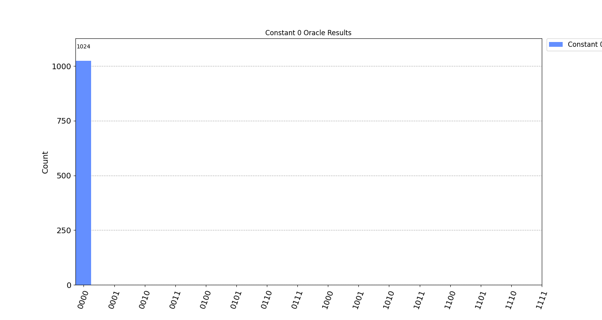
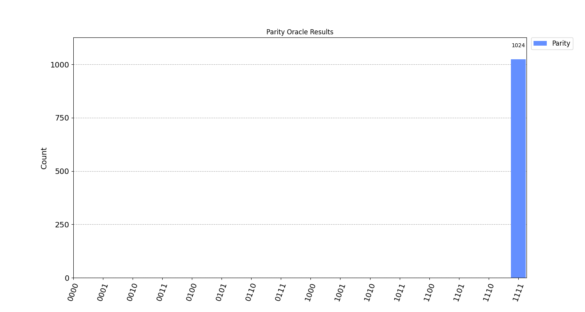

# Deutsch-Jozsa Algorithm with Qiskit

This repository contains a Python implementation of the **Deutsch-Jozsa algorithm** using [Qiskit](https://qiskit.org/). The code demonstrates two different oracles:

1. A **Constant 0 Oracle**, which always returns the same output (0).
2. A **Parity (Balanced) Oracle**, which flips the output qubit based on the parity of the input qubits.

The goal of the Deutsch-Jozsa algorithm is to determine whether an unknown oracle is *constant* or *balanced* using fewer queries than a classical approach.

## Description

- **Deutsch-Jozsa Algorithm**:
  - The algorithm prepares \( n \) input qubits and 1 output qubit.
  - The output qubit is initialized to \(|1\rangle\), then all qubits (input + output) are put in superposition with Hadamard gates.
  - The oracle (a unitary transformation) is applied to the qubits.
  - Another set of Hadamard gates is applied to the input qubits.
  - Finally, the input qubits are measured.
  - The result of these measurements indicates whether the oracle is constant or balanced.

- **Constant 0 Oracle**: Returns 0 for every possible input state.

- **Parity Oracle**: Flips the output qubit if the number of \(|1\rangle\)s among the input qubits is odd (i.e., balanced behavior).

## File Contents

- **`deutsch_jozsa.py`** (or whichever name you choose):
  - Imports necessary libraries and configures your IBM Quantum Experience account.
  - Defines the constant and balanced oracles.
  - Constructs the Deutsch-Jozsa circuit.
  - Transpiles and runs the circuits on either a real IBMQ backend or the local Aer simulator.
  - Plots and saves the result histograms.

- **`constant_0_results.png`**:
  - Histogram showing measurement results for the Constant 0 Oracle.
  - You will see that almost all counts collapse to one bitstring (e.g., `0000`) indicating a constant function.

- **`parity_results.png`**:
  - Histogram showing measurement results for the Parity Oracle.
  - You will see the measurement results distribute among states of a certain parity (e.g., mostly `1111`), indicating a balanced function.

## Installation and Setup

1. **Clone the repository**:
   ```bash
   git clone https://github.com/yourusername/deutsch-jozsa-qiskit.git
   cd deutsch-jozsa-qiskit
   ```

2. **Install Qiskit** (if you haven’t already):
   ```bash
   pip install qiskit qiskit-ibm-provider
   ```

3. **Configure IBM Quantum Account**:
   - The code includes a line to include your IBM Quantum Experience token:
     ```python
     IBMProvider.save_account('<IBMQ_API_KEY>', overwrite=True)
     ```
   - Replace `<IBMQ_API_KEY>` with your actual token from the IBM Quantum dashboard.

4. **Additional Libraries**:
   - [matplotlib](https://matplotlib.org/) for plotting histograms.
   - [job_monitor](https://qiskit.org/documentation/apidoc/qiskit.tools.monitor.html) for monitoring job status.

## Usage

1. **Run the Script**:
   ```bash
   python deutsch_jozsa.py
   ```
   - This will build and transpile the Deutsch-Jozsa circuits for both the Constant 0 and Parity oracles.
   - By default, the script uses the local Aer simulator. If you want to use a real quantum device, uncomment one of the lines such as:
     ```python
     backend = provider.get_backend('ibmq_manila')
     ```
   - The script then runs the jobs, retrieves the results, and plots histograms of the measurement outcomes.

2. **View Output**:
   - After running the script, you should see two new PNG files in your directory:
     - **`constant_0_results.png`**
     - **`parity_results.png`**

3. **Interpreting the Results**:
   - **Constant 0 Oracle**:
     - The histogram will show a single dominant bitstring (all zeros).
     - Indicates the oracle is constant.
   - **Parity Oracle**:
     - The histogram will show a dominant bitstring corresponding to all ones (or another clear pattern) depending on the parity construction.
     - Indicates the oracle is balanced.

## Output Graphs

Below are previews of the expected output graphs:

| Constant 0 Oracle | Parity Oracle |
|-------------------|---------------|
|  |  |

From these histograms, you can see the stark difference between the **constant** and **balanced** (parity) oracles.

## Customizing the Oracles

- **Constant 0 Oracle**: Always outputs `0`.
- **Parity Oracle** (Version 1): Applies a `CX` from each input qubit to the output qubit.
- **Parity Oracle** (Version 2): Demonstrates how to reduce the number of controls if desired (commented out in the code).

You can modify these oracles to explore other balanced functions or try different numbers of qubits (`n`).

## License

This project is open-source; feel free to use, modify, and distribute it under the terms of the [MIT License](LICENSE).
